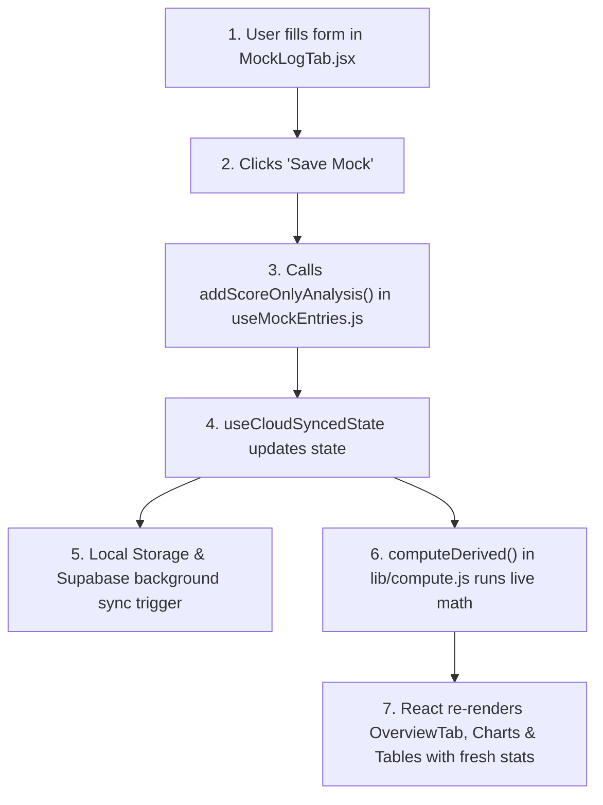

# 🚀 Odyssey: Developer & Architecture Guide
*From AI-Assisted Building to Hands-On Code Ownership*

---

## 1. The Mindset Transition

Taking ownership of a codebase after relying on AI agents is a huge and empowering step. 

The good news: **Odyssey is clean, modular, and built on predictable web standards.** You do **not** need a Computer Science degree or years of experience to tweak the design, update formulas, or add features.

In modern web development with React:
1. Everything is a **Component** (a reusable piece of UI, like a button, card, or chart).
2. Data flows **down** from parent components to child components via **Props**.
3. UI updates automatically when **State** changes.
4. Business logic (formulas, statistics, date math) is kept separate in **Pure JavaScript helper files**.

---

## 2. Tech Stack Overview

Here is every technology used in Odyssey and the specific role it plays:

| Technology | Role in Odyssey | Key File / Directory |
|---|---|---|
| **Vite** | Lightning-fast development server and asset bundler. Runs the local server when you type `npm run dev`. | [`vite.config.js`](file:///Users/mohitchoudhary/Downloads/Odyssey/vite.config.js) |
| **React 18** | UI framework. Controls components, user interface rendering, and application state. | [`src/App.jsx`](file:///Users/mohitchoudhary/Downloads/Odyssey/src/App.jsx), [`src/components/`](file:///Users/mohitchoudhary/Downloads/Odyssey/src/components/) |
| **Tailwind CSS** | Utility-first CSS framework for layout, margins, padding, typography, and responsive design. | [`tailwind.config.js`](file:///Users/mohitchoudhary/Downloads/Odyssey/tailwind.config.js), [`src/index.css`](file:///Users/mohitchoudhary/Downloads/Odyssey/src/index.css) |
| **CSS Variables** | System theme variables (light mode & dark mode palette definitions). | [`src/constants.js`](file:///Users/mohitchoudhary/Downloads/Odyssey/src/constants.js), `themeVariableCSS` in [`src/App.jsx`](file:///Users/mohitchoudhary/Downloads/Odyssey/src/App.jsx#L47-L81) |
| **Recharts** | Interactive SVG charting library for score trends, section accuracy, radar charts, and score leak visualizer. | [`src/components/charts/`](file:///Users/mohitchoudhary/Downloads/Odyssey/src/components/charts/) |
| **Lucide React** | Clean vector icons used across buttons, headers, and nav items (e.g. `<BarChart3 />`, `<Plus />`). | Imported inside components |
| **Supabase JS** | Cloud database sync client. Keeps your mock entries backed up to PostgreSQL automatically. | [`src/lib/supabaseClient.js`](file:///Users/mohitchoudhary/Downloads/Odyssey/src/lib/supabaseClient.js), [`src/lib/cloudStore.js`](file:///Users/mohitchoudhary/Downloads/Odyssey/src/lib/cloudStore.js) |
| **Vitest** | Unit test framework to verify score calculation math and formulas automatically. | Run via `npm test`, files in `__tests__/` |

---

## 3. Project Directory Map

Here is how the project is organized on disk:

```text
Odyssey/
├── index.html                  # HTML template root entry
├── package.json                # Project dependencies & scripts (npm run dev)
├── tailwind.config.js          # Tailwind CSS settings
├── vite.config.js              # Vite server & bundler configuration
├── supabase/
│   └── schema.sql              # Database table definition for Supabase
└── src/
    ├── main.jsx                # Entry point mounting React to DOM
    ├── App.jsx                 # Root component: handles tabs, theme CSS, top header
    ├── constants.js            # Color palettes, design tokens, section definitions
    ├── index.css               # Global CSS resets & Tailwind directives
    │
    ├── components/             # ALL UI VISUAL COMPONENTS
    │   ├── layout/             # Header, Navigation bar, Cloud Sync status badge
    │   ├── tabs/               # Main pages: Overview, Mock Log, Analysis, Trends, Syllabus, Account
    │   ├── ui/                 # Small reusable UI widgets: StatCard, FieldLabel, SectionBadge, Toast, etc.
    │   ├── charts/             # Recharts chart components (Line, Bar, Radar, Signals)
    │   ├── syllabus/           # Syllabus progress bars and snapshot cards
    │   └── topics/             # Topic tagging and selection modal
    │
    ├── hooks/                  # CUSTOM REACT HOOKS (STATE & DATA MANIPULATION)
    │   ├── useMockEntries.js   # Central state manager for parent mock entries & stats
    │   ├── useSettings.js     # Account preferences (targets, exam date, schedule, layout)
    │   ├── useSyllabus.js     # User syllabus topic progress & completion rates
    │   ├── useCloudSyncedState.js # Dual-storage bridge (localStorage + Supabase background sync)
    │   └── useHashTab.js       # URL hash navigation (e.g. #log, #analysis, #trends)
    │
    └── lib/                    # PURE JAVASCRIPT LOGIC & FORMULAS (NO REACT UI HERE)
        ├── compute.js          # Derived stats: marks, attempt rates, accuracy, rolling averages
        ├── mockModel.js        # Mock data structure builders & normalizers
        ├── scoreLeak.js        # Score leakage breakdown (unattempted vs wrong vs penalty)
        ├── percentile.js       # CAT percentile interpolation and curves
        ├── collegeCutoffs.js   # Target college percentile benchmarks
        ├── syllabusData.js     # CAT exam syllabus master topic list
        └── cloudStore.js       # Supabase database upload/download calls
```

---

## 4. The Developer Cheat Sheet: "Where Do I Go To Change X?"

Use this reference table whenever you want to make a specific modification:

### 🎨 1. Styling, Themes, and Layout (UI Changes)

| What do you want to change? | File to edit | Explanation |
|---|---|---|
| **Theme Colors (Light/Dark Mode)** | [`src/constants.js`](file:///Users/mohitchoudhary/Downloads/Odyssey/src/constants.js#L37-L80) & [`src/App.jsx`](file:///Users/mohitchoudhary/Downloads/Odyssey/src/App.jsx#L47-L81) | Edit hex colors in `THEME_COLORS` (`light` and `dark` objects). |
| **Fonts & Global Resets** | [`src/index.css`](file:///Users/mohitchoudhary/Downloads/Odyssey/src/index.css) & [`tailwind.config.js`](file:///Users/mohitchoudhary/Downloads/Odyssey/tailwind.config.js) | Change font family imports or custom Tailwind utilities. |
| **Top Bar Header & App Title** | [`src/components/layout/Header.jsx`](file:///Users/mohitchoudhary/Downloads/Odyssey/src/components/layout/Header.jsx) | Edits the header logo, theme toggle button, and sync indicator. |
| **Tab Bar Navigation** | [`src/components/layout/TabNav.jsx`](file:///Users/mohitchoudhary/Downloads/Odyssey/src/components/layout/TabNav.jsx) | Change tab names, icons, or navigation buttons. |
| **Reusable UI Elements (Cards, Inputs, Badges, Toast)** | [`src/components/ui/`](file:///Users/mohitchoudhary/Downloads/Odyssey/src/components/ui/) | Customize standard form fields ([`FieldLabel.jsx`](file:///Users/mohitchoudhary/Downloads/Odyssey/src/components/ui/FieldLabel.jsx)), metric cards ([`StatCard.jsx`](file:///Users/mohitchoudhary/Downloads/Odyssey/src/components/ui/StatCard.jsx)), badges ([`SectionBadge.jsx`](file:///Users/mohitchoudhary/Downloads/Odyssey/src/components/ui/SectionBadge.jsx)). |

---

### 🧮 2. Score Logic, Formulas & CAT Mathematics

| What do you want to change? | File to edit | Explanation |
|---|---|---|
| **Marking Scheme & Derived Stats** | [`src/lib/compute.js`](file:///Users/mohitchoudhary/Downloads/Odyssey/src/lib/compute.js) | Functions like `computeDerived()` compute total marks `(Right * 3 - Wrong * 1)`, accuracy `%`, attempt rates, and 5-mock rolling averages. |
| **Score Leakage Calculations** | [`src/lib/scoreLeak.js`](file:///Users/mohitchoudhary/Downloads/Odyssey/src/lib/scoreLeak.js) | Computes marks lost due to unattempted questions vs wrong answers vs negative marking. |
| **Percentiles & College Cutoffs** | [`src/lib/percentile.js`](file:///Users/mohitchoudhary/Downloads/Odyssey/src/lib/percentile.js) & [`src/lib/collegeCutoffs.js`](file:///Users/mohitchoudhary/Downloads/Odyssey/src/lib/collegeCutoffs.js) | Maps total marks to estimated CAT percentile and provides static college cutoff reference data for admins. |
| **Syllabus Topics & Quant/VARC/DILR Structure** | [`src/lib/syllabusData.js`](file:///Users/mohitchoudhary/Downloads/Odyssey/src/lib/syllabusData.js) | Add or edit CAT topics, subtopics, and difficulty tags. |

---

### 📊 3. Charts & Analytics Pages

| What do you want to change? | File to edit | Explanation |
|---|---|---|
| **Overview Landing Dashboard** | [`src/components/tabs/OverviewTab.jsx`](file:///Users/mohitchoudhary/Downloads/Odyssey/src/components/tabs/OverviewTab.jsx) | Controls top key metrics, score leakage hero block, and target section overview. |
| **Mock Score Entry & Table** | [`src/components/tabs/MockLogTab.jsx`](file:///Users/mohitchoudhary/Downloads/Odyssey/src/components/tabs/MockLogTab.jsx) & [`src/components/MockLogTable.jsx`](file:///Users/mohitchoudhary/Downloads/Odyssey/src/components/MockLogTable.jsx) | Controls score logging forms, batch JSON import, and row editing. |
| **Detailed Question-by-Question Analysis** | [`src/components/tabs/AnalysisTab.jsx`](file:///Users/mohitchoudhary/Downloads/Odyssey/src/components/tabs/AnalysisTab.jsx) | Edit question review table, error reasons, time taken per question, and reflection text. |
| **Score Trend Line Charts** | [`src/components/charts/MultiSectionLineChart.jsx`](file:///Users/mohitchoudhary/Downloads/Odyssey/src/components/charts/MultiSectionLineChart.jsx) & [`src/components/charts/PercentileTrendChart.jsx`](file:///Users/mohitchoudhary/Downloads/Odyssey/src/components/charts/PercentileTrendChart.jsx) | Customize chart colors, axes, tooltips, or smooth lines. |
| **Account & Storage Controls** | [`src/components/tabs/AccountTab.jsx`](file:///Users/mohitchoudhary/Downloads/Odyssey/src/components/tabs/AccountTab.jsx) | Manage profile details, targets, layout, mock schedule, and backup controls. |

---

## 5. Data Flow Walkthrough: What Happens When You Click "Save Mock"?

Understanding how data travels through the app will demystify React for you:



Because of this structure, **you never manually update charts or tables**. You only update the mock data list, and React automatically updates every chart, card, and indicator across the entire app!

---

## 6. Practical Learning Roadmap for You

You don't need to read a 500-page textbook. Focus on these 4 practical topics to gain complete mastery over this project:

### Phase 1: Reading React JSX (HTML inside JavaScript)
- **Concept**: In React files (`.jsx`), JavaScript functions return HTML-like code.
- **Key Syntax**:
  - HTML `class` becomes `className` (e.g. `<div className="p-4 bg-white rounded-lg">`).
  - JavaScript variables inside HTML are wrapped in curly braces `{}` (e.g. `<h1>{mock.source}</h1>`).
  - Conditional rendering: `{isSyncing ? <Spinner /> : <CheckIcon />}`.

### Phase 2: Understanding Tailwind CSS Classes
- Tailwind uses small class names directly on elements:
  - Flexbox layout: `flex flex-row items-center justify-between`
  - Spacing: `p-4` (padding 1rem), `mb-2` (margin bottom 0.5rem), `gap-3` (gap between flex items)
  - Text: `text-sm font-semibold text-gray-700`
  - Rounded borders & cards: `rounded-xl border border-gray-200 bg-white shadow-sm`

### Phase 3: Pure JavaScript Array Methods (Crucial for Data Logic)
In [`src/lib/compute.js`](file:///Users/mohitchoudhary/Downloads/Odyssey/src/lib/compute.js), you will see 3 array methods used repeatedly:
- `.map()`: Transforms every item in a list (e.g. converts raw mock entries into chart data points).
- `.filter()`: Filters list by condition (e.g. gets only VARC section entries).
- `.reduce()`: Calculates sums or averages from a list of numbers.

### Phase 4: Hands-On Practice Exercises (Start Small!)

Try these 3 small experiments to build real practical confidence:

1. **Exercise 1 (Design)**: Open [`src/constants.js`](file:///Users/mohitchoudhary/Downloads/Odyssey/src/constants.js#L37-L55). Modify the primary or section colors (e.g. change Quant color `#3E6FBF` to another shade) and see how it reflects live in your browser.
2. **Exercise 2 (UI Text)**: Open [`src/components/layout/Header.jsx`](file:///Users/mohitchoudhary/Downloads/Odyssey/src/components/layout/Header.jsx). Locate the subtitle text and customize it to your personal exam countdown message.
3. **Exercise 3 (Logic & Math)**: Open [`src/lib/compute.js`](file:///Users/mohitchoudhary/Downloads/Odyssey/src/lib/compute.js). Look at `computeDerived` and trace how `totalMarks` is calculated: `(rightMcq * 3) + (rightTita * 3) - (wrongMcq * 1)`.

---

## 7. Developer Commands Quick Reference

Run these commands in your shell inside `/Users/mohitchoudhary/Downloads/Odyssey`:

```bash
# Start local dev server (opens preview in browser)
npm run dev

# Run unit tests to check math logic
npm test

# Build production distribution bundle
npm run build
```
